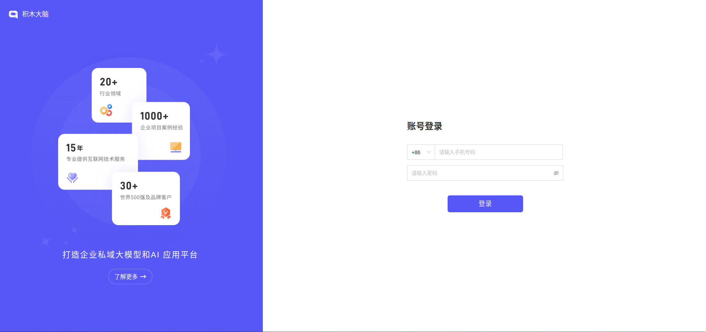
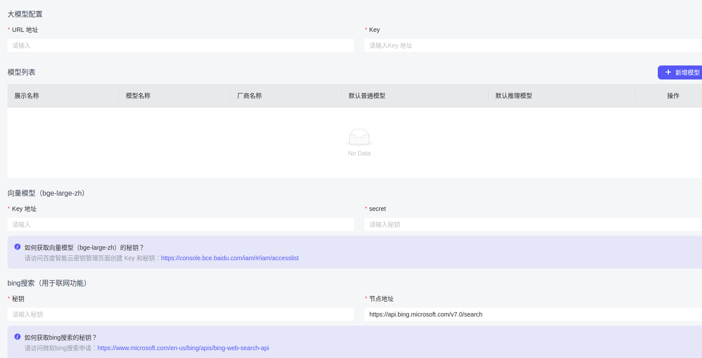

# 积木大脑-lite 智能平台本地化部署文档




## 环境要求
✅ **容器环境**
- Docker Engine ≥ 26.x
- Docker Compose ≥ v2.33.x

🌍 官网地址：https://www.jeemoo.com

## 端口配置
⚠️ **默认端口**
```yaml
ports:
  - "80:80"      # Web服务端口
  - "8080:8080"  # API服务端口
```

🚨 **端口冲突解决方案**  
修改docker-compose.yml中nginx服务的端口映射（示例）：
```yaml
ports:
  - "81:80"      # 修改后Web端口
  - "8081:8080"  # 修改后API端口
```

## 部署指南
### 本地快速部署
```bash
docker-compose up -d
```

### 云端服务器部署
1. 修改`frontend-build`服务配置：
```yaml
environment:
  API_HOST: "您的实际接口地址"  # 例如 https://api.yourdomain.com
```
2. 启动服务：
```bash
docker-compose up -d
```

## 系统访问
🔑 **默认管理员凭证**
```
账号: admin
密码: a123456@
```

## 首次登录配置
1. **核心模型配置**
   - 对话模型：选择大模型类型
   - 模型列表：添加实际可用的模型名称

2. **知识库配置**
   - 向量搜索引擎：选择`百度云bge-large-zh`

3. **对话增强配置**
   - 启用Bing搜索集成

## 关键注意事项
1. 端口修改后需同步调整相关服务的访问地址
2. 百度云bge-large-zh需确保API密钥正确配置
3. Bing搜索功能需申请有效的API密钥
4. 建议生产环境启用HTTPS加密
5. 启动失败请检查容器日志：
```bash
docker-compose logs -f
```


> 提示：部署完成后请通过 `http://服务器IP:端口` 访问系统（默认端口80）
